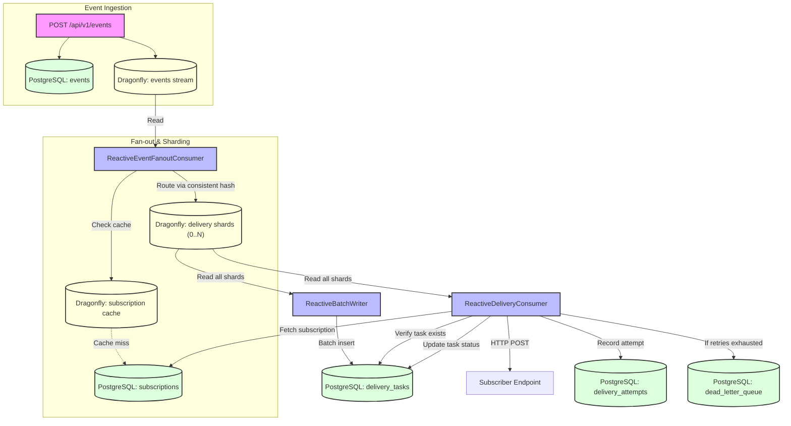

# **HookSwarm**

HookSwarm is a high-performance webhook delivery system built on Java 21, Spring WebFlux/Netty, R2DBC, and DragonflyDB as cache and active queue.

It is designed to reliably fan out events to thousands of subscribers with sub‑100ms latency, while maintaining exactly‑once delivery semantics and surviving downstream failures through intelligent retries, circuit breakers, and a dead‑letter queue.

## **Features**

- **Asynchronous, non‑blocking event ingestion** that never blocks the caller.
- **Reliable fan‑out** to all active subscriptions, even for events with thousands of subscribers.
- **Horizontal scalability** with sharded Dragonfly streams and fully concurrent consumer reads. Dial up performance by adding more instances and shards.
- **Exponential backoff retries** with configurable jitter.
- **Per‑endpoint circuit breakers** to isolate failing destinations.
- **Dead‑letter queue** for messages that exceed retry limits.
- **Comprehensive observability** via Micrometer metrics and structured logging.
- **Fine‑grained control:** All policies (retry, circuit breaker, concurrency limits) are fully configurable and can be tuned per tenant.

All of this is achieved with a fully reactive stack, which can deliver high throughput and low latency even on modest hardware.

**[UI is still under development]**

## Deployment

### Development

```bash
cd docker/docker-compose
docker-compose up -d
```

### Production

```bash
cd docker/docker-compose
docker-compose -f docker-compose.yml -f docker-compose.prod.yml up -d --build
```

## **Event Lifecycle**



## **API Examples**

All endpoints are reactive and return JSON. Below are illustrative examples.

### Ingest an Event

```
POST /api/v1/events
Content-Type: application/json
{
  "eventType": "invoice.paid",
  "payload": {
    "invoiceId": "inv_123",
    "amount": 2999
  },
  "idempotencyKey": "req_abc123"
}
```

Response (201 Created):
```json
{
  "id": "01J0X7K2Q5Z8P9M4N2L6B3T1V",
  "eventType": "invoice.paid",
  "payload": {...},
  "idempotencyKey": "req_abc123",
  "createdAt": "2025-03-15T10:30:45Z"
}
```

### Create a Subscription

```
POST /api/v1/subscriptions
Content-Type: application/json
{
  "url": "https://api.acme.com/webhook",
  "secret": "whsec_abc123...",
  "eventTypes": ["invoice.paid", "customer.created"],
  "maxRetries": 10
}
```

Response (201 Created):
```json
{
  "id": "01J0X7K2Q5Z8P9M4N2L6B3T1V",
  "url": "https://api.acme.com/webhook",
  "eventTypes": ["invoice.paid", "customer.created"],
  "status": "ACTIVE",
  "maxRetries": 10,
  "createdAt": "2025-03-15T10:35:12Z"
}
```

### List Deliveries for an Event

```
GET /api/v1/deliveries?eventId=01J0X7K2Q5Z8P9M4N2L6B3T1V
```

Response (200 OK):
```json
[
  {
    "id": "01J0X7K3M6N9B4V5C2X8Z1L7",
    "eventId": "01J0X7K2Q5Z8P9M4N2L6B3T1V",
    "subscriptionId": "01J0X7K2Q5Z8P9M4N2L6B3T1V",
    "status": "DELIVERED",
    "attemptCount": 1,
    "createdAt": "2025-03-15T10:30:46Z"
  }
]
```

### Inspect Delivery Attempts

```
GET /api/v1/deliveries/01J0X7K3M6N9B4V5C2X8Z1L7/attempts
```

Response:
```json
[
  {
    "id": "01J0X7K4R8P2M6N9B3V5C1X2",
    "attemptNumber": 1,
    "httpStatusCode": 200,
    "responseBody": "OK",
    "latencyMs": 124,
    "attemptedAt": "2025-03-15T10:30:47Z"
  }
]
```

### Replay a Dead‑Letter Entry

```
POST /api/v1/dlq/01J0X7K5T9P4M7N2B6V8C3X5/replay
```

Response (202 Accepted) – returns the newly created delivery task.

---
